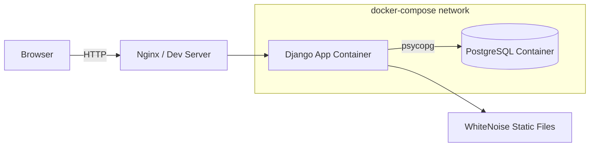

<div align="center">

```
 ██████╗ ███████╗██╗   ██╗ ██████╗ ██████╗ ███████╗
 ██╔══██╗██╔════╝██║   ██║██╔═══██╗██╔══██╗██╔════╝
 ██║  ██║█████╗  ██║   ██║██║   ██║██████╔╝███████╗
 ██║  ██║██╔══╝  ╚██╗ ██╔╝██║   ██║██╔═══╝ ╚════██║
 ██████╔╝███████╗ ╚████╔╝ ╚██████╔╝██║     ███████║
 ╚═════╝ ╚══════╝  ╚═══╝   ╚═════╝ ╚═╝     ╚══════╝
        N O T E S   //   terminal_mode: true
```

**A self-hosted, terminal-themed notes app for engineers who live in the CLI.**

[](https://www.djangoproject.com/)
[](https://www.postgresql.org/)
[](https://www.docker.com/)
[](LICENSE)

</div>

---

## `> whoami`

**DevOps Notes** is a lightweight, self-hosted note-taking app built to actually *learn* DevOps by shipping something real — not just reading about it. Every layer of this repo doubles as a hands-on lesson: containerization, multi-stage builds, environment-driven config, and production-style static file handling.

It looks like a terminal. It runs like a real app. It deploys with one command.

```bash
$ docker-compose up --build
[+] Building ██████████████████████ done
[+] Running 3/3
 ✔ Container notes_db      Started
 ✔ Container notes_web     Started
 ✔ Container notes_nginx   Started
$ echo "ready → http://localhost:8000"
```

---

## `> features --list`

- 🖥️ **Terminal-themed UI** — monospace, dark-mode-first, cursor-blink aesthetic
- 📝 **Full CRUD notes engine** — create, tag, search, archive
- 🔐 **Session-based auth** — no bloated third-party identity stack
- 🐘 **PostgreSQL-backed** — real relational storage, not SQLite toy-mode
- 🐳 **Multi-stage Dockerfile** — separate build & runtime stages for a lean final image
- 📦 **docker-compose orchestration** — app + db (+ optional reverse proxy) wired together
- 🎯 **WhiteNoise static serving** — production-style static files with zero extra infra
- ⚙️ **12-factor config** — everything sensitive lives in `.env`, never in code

---

## `> stack --verbose`

| Layer            | Technology                          |
|------------------|--------------------------------------|
| Backend          | Django 5.2 LTS (Python 3.12)         |
| Database         | PostgreSQL 16                        |
| Static Files     | WhiteNoise                           |
| Containerization | Docker (multi-stage build)           |
| Orchestration    | Docker Compose                       |
| Frontend         | HTML/CSS (custom terminal theme), vanilla JS |

---

## `> architecture`



The Dockerfile builds in **two stages**:

1. **Builder stage** — installs build deps, compiles wheels, resolves Python packages
2. **Runtime stage** — copies only the compiled artifacts + app code into a slim final image

Result: a smaller attack surface, faster rebuilds, and no leftover compiler toolchain bloating the shipped container.

---

## `> quickstart`

```bash
# 1. Clone it
git clone https://github.com/<your-username>/devops-notes-app.git
cd devops-notes-app

# 2. Configure environment
cp .env.example .env
# edit .env with your DB credentials, SECRET_KEY, etc.

# 3. Build & launch
docker-compose up --build

# 4. Run migrations (first time only)
docker-compose exec web python manage.py migrate

# 5. Create an admin user
docker-compose exec web python manage.py createsuperuser
```

Then open **http://localhost:8000** and start taking notes like it's `vim` — but with a mouse if you insist.

---

## `> local-dev-notes`

Built and battle-tested on **Windows + PowerShell**. A couple of platform gotchas worth knowing if you're following along:

- **`psycopg` binary wheels** — on Windows, prefer `psycopg[binary]` in `requirements.txt` to avoid needing a full C build toolchain locally.
- **WhiteNoise + `collectstatic`** — make sure `STATICFILES_STORAGE` / `STORAGES` is configured *before* running `collectstatic` inside the container, or static assets silently fail to compress/hash correctly.

---

## `> project-structure`

```
devops-notes-app/
├── notes/                 # Django app: models, views, urls
├── core/                  # Project settings & config
├── static/                # Terminal-theme CSS/JS
├── templates/             # HTML templates
├── Dockerfile             # Multi-stage build
├── docker-compose.yml     # App + Postgres orchestration
├── requirements.txt
├── .env.example
└── manage.py
```

---

## `> roadmap`

- [ ] CI/CD pipeline (GitHub Actions → build, test, push image)
- [ ] Tagging & full-text search
- [ ] Nginx reverse proxy + HTTPS via Let's Encrypt
- [ ] Kubernetes manifests (learning stretch goal)
- [ ] Markdown rendering for notes

---

## `> contributing`

This is primarily a learning project, but issues, suggestions, and PRs are welcome — especially if you spot a more idiomatic Docker or Django pattern.

```bash
$ git checkout -b feature/your-idea
$ git commit -m "feat: your idea"
$ git push origin feature/your-idea
```

---

## `> license`

MIT — do what you want with it, just don't blame me if your terminal theme becomes an addiction.

<div align="center">

`built with docker, django, and a healthy respect for multi-stage builds.`

</div>
